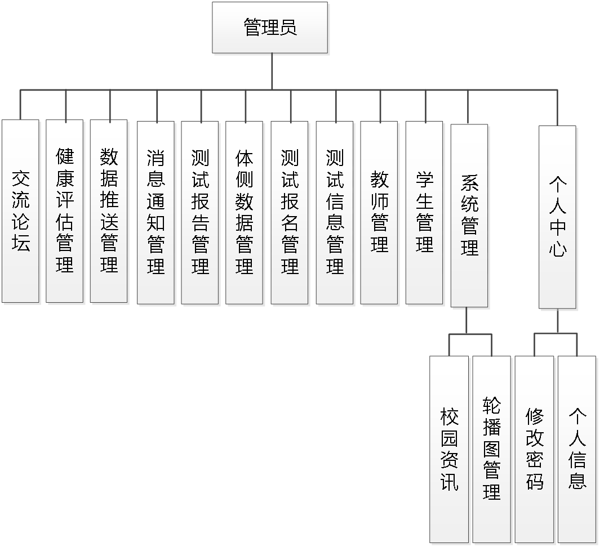
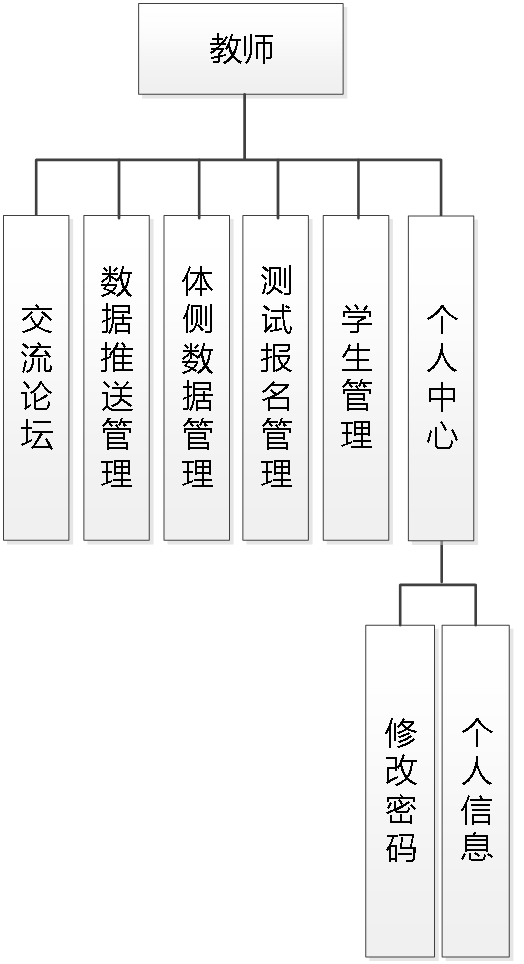
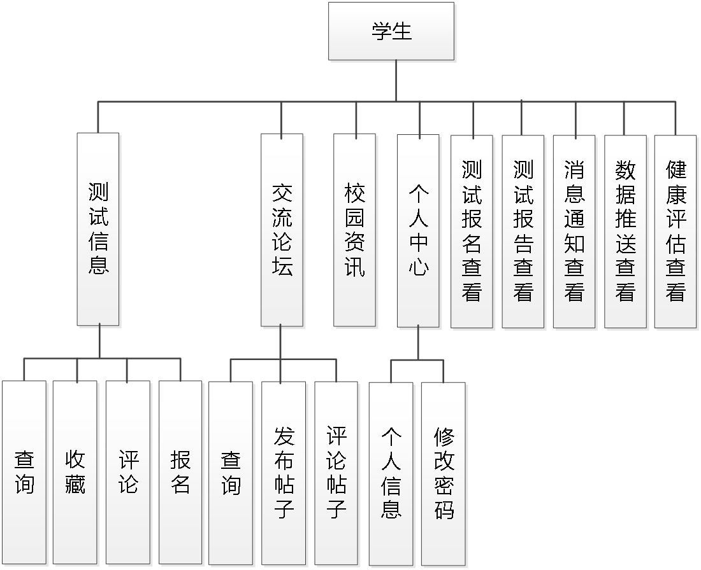
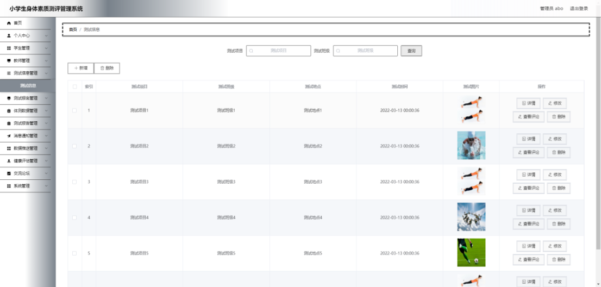
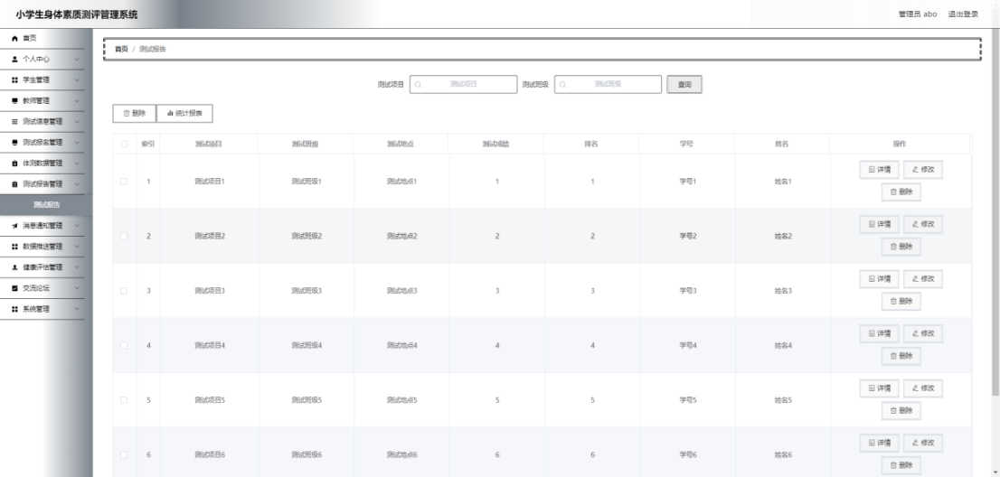
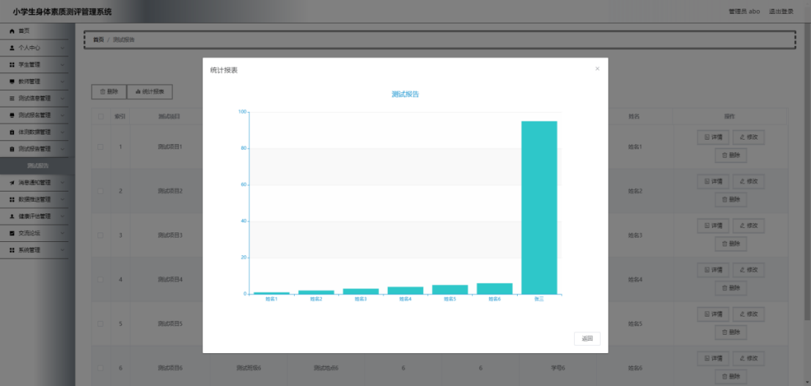
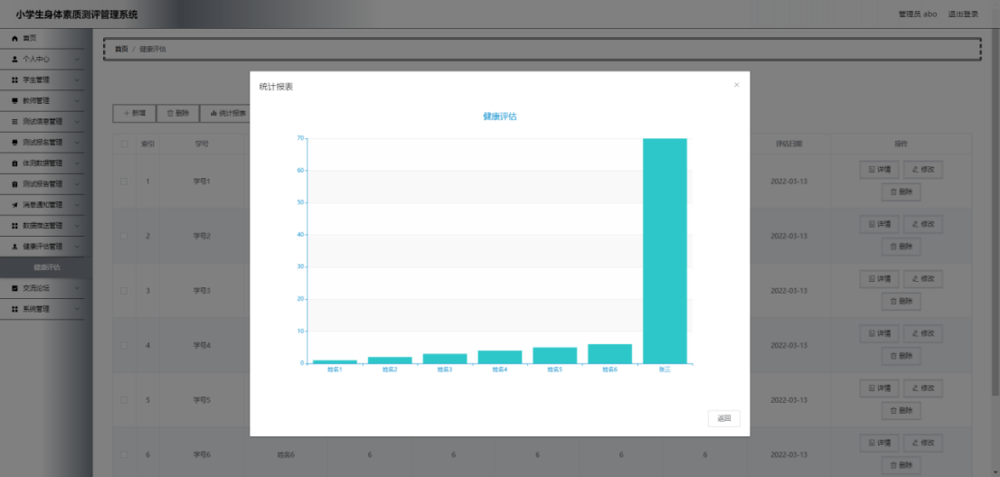
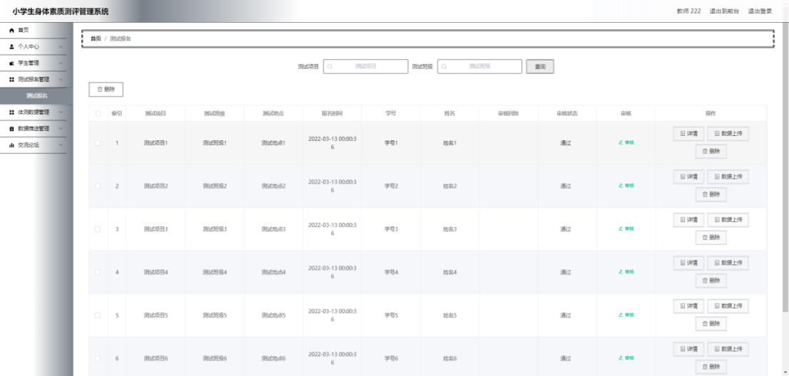
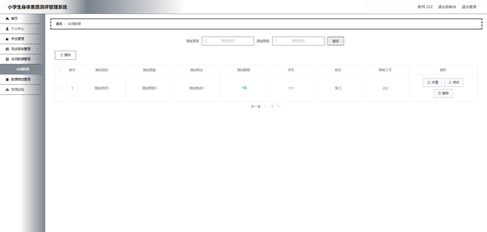
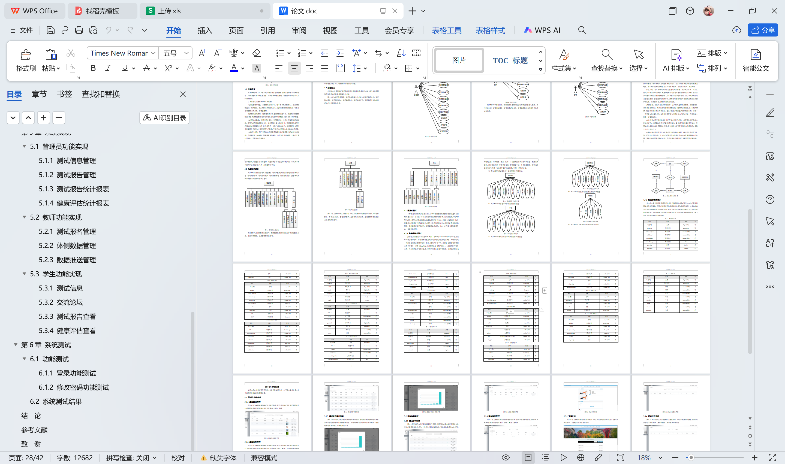

# springboot145-小学生身体素质测评管理系统设计

>  博主介绍：
>  Hey，我是程序员Chaers，一个专注于计算机领域的程序员
>  十年大厂程序员全栈开发‍ 日常分享项目经验 解决技术难题与技术推荐 承接各类网站设计，小程序开发，毕设等。
>  【计算机专业课程设计，毕业设计项目，Java，微信小程序，安卓APP都可以做，不仅仅是计算机专业，其它专业都可以】

## 3000套系统可挑选，获取链接：https://chaerspol.github.io/

<b>QQ【获取完整源码】：674456564</b>

<b>QQ群【获取完整源码】：1058861570</b>

### 系统架构

> 前端：html | js | css | jquery | vue
>
> 后端：springboot | mybatis
> 
> 环境：jdk1.8+ | mysql | maven

# 一、内容包括
包括有  项目源码+项目论文+数据库源码+答辩ppt+远程调试成功

# 二、运行环境

> jdk版本：1.8 及以上； ide工具：IDEA； 数据库: mysql5.7及以上；编程语言: Java

# 三、需求分析

**3.1 可行性分析**

从三个不同的角度来分析，确保开发成功的前提是有可行性分析，只有进行提前分析，符合程序开发流程才不至于开发过程的中断。

**3.1.1 技术可行性**

在技术实现层次，分析了好几种技术实现方法，并且都有对应的成功案例，也有很多开源模块可以进行参考，所以从技术可行性分析来讲，实现小学生身体素质测评管理系统是没有问题的。

**3.1.2 经济可行性**

对于身为学生的开发者而言，在经济资源上面可用者很少，为了开发小学生身体素质测评管理系统，通过开发软件对硬件的要求，发现自己的电脑是完全能用来开发的，并且学校机房的配置也可以达到要求。最重要的是选择的技术都可以在网上找到不花钱的教程以及资料，因为不花钱，所以经济方面是具有可行性的。

**3.1.3 操作可行性**

小学生身体素质测评管理系统的具体实现，本身参考人类的正常操作逻辑，把常用的操作习惯当做主要的导航实现，可以让使用者更快速的理解并且上手操作，实现符合逻辑的操作流程是操作可行性的具体体现。
以上就是从不同的角度来分析，确保了小学生身体素质测评管理系统的正常开展。

**3.2 系统流程**

小学生身体素质测评管理系统投入使用后，使用者如果能看到相应的流程操作图会提高程序的理解能力。
使用者在操作小学生身体素质测评管理系统中，应该按照本系统提供的操作流程（下图即为本系统的操作流程图）进行操作，可以减少操作失误，从而节省进入小学生身体素质测评管理系统的时间。

# 四、功能模块

下图即为设计的管理员功能结构，管理员权限操作的功能包括管理测试信息，管理测试报告，管理消息通知，管理数据推送，管理健康评估，查看测试报告和健康评估的统计报表信息等

下图即为设计的教师功能结构，教师权限操作的功能包括审核测试报名信息，上传体测数据，管理数据推送信息等。

下图即为设计的学生功能结构，学生权限操作的功能包括对测试项目进行报名，参与论坛交流，查看测试报告，查看健康评估信息，查看数据推送信息以及消息通知信息等。

# 五、效果图展示【部分效果图】

图5.1 测试信息管理界面【图5.1 即为编码实现的测试信息管理界面，管理员在测试信息管理界面中可以对界面中显示的所有测试信息进行更改，查询，删除】

图5.2 测试报告管理界面【图5.2 即为编码实现的测试报告管理界面，管理员在测试报告管理界面中可以为本界面显示的所有测试报告信息进行查询，修改，删除，可以查看测试报告的统计报表】

图5.3 测试报告统计报表界面【图5.3 即为编码实现的测试报告统计报表界面，管理员在测试报告统计报表界面中查看测试报告的统计报表信息，该统计报表是以柱形图的形式展现，能直观表达出各个学生的测试成绩信息】

图5.4 健康评估统计报表界面【图5.4 即为编码实现的健康评估统计报表界面，管理员在健康评估统计报表界面查看各个学生的健康评估综合素质分】

图5.5 测试报名管理界面【图5.5 即为编码实现的测试报名管理界面，教师在测试报名管理界面中审核学生的测试报名信息，可以上传学生的测试数据信息，可以查询测试报名信息等。】

图5.6 体侧数据管理界面【图5.6 即为编码实现的体侧数据管理界面，教师在体侧数据管理界面中修改体侧数据信息，查询体侧数据信息，删除体侧数据信息等】

 <b>完整文章</b>
 

 

## 3000套系统可挑选，获取链接：https://chaerspol.github.io/

<b>QQ【获取完整源码】：674456564</b>

<b>QQ群【获取完整源码】：1058861570</b>

